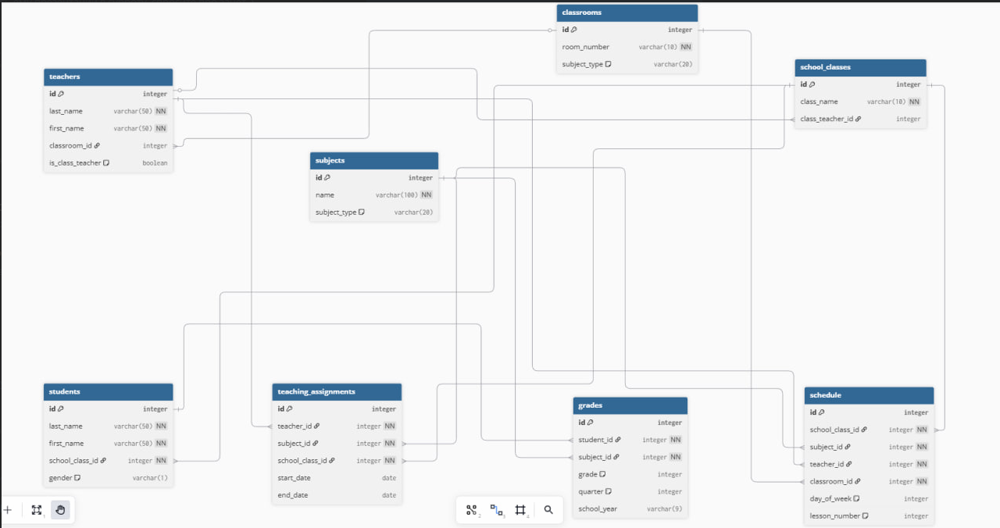

# Введение

## 🎯 Цель работы

Овладеть практическими навыками реализации серверной части приложений средствами Django REST Framework.

## 📋 Постановка задачи

Создать систему для завуча школы с функциями:

1. **Хранение данных:**
   - Учителя (ФИО, предметы, кабинеты)
   - Ученики (ФИО, класс, оценки)
   - Расписание занятий

2. **Управление:**
   - Добавление/удаление учителей и учеников
   - Внесение и изменение оценок
   - Составление расписания

3. **Отчетность:**
   - Успеваемость классов
   - Статистика по полу
   - Количество кабинетов

## ER-диаграмма базы данных

## 🏗️ Технологии

- **Backend:** Django + Django REST Framework
- **База данных:** SQLite
- **Аутентификация:** Token-based (Djoser)
- **Документация:** Swagger/ReDoc

## ✅ Реализованные функции

| Функция | Статус |
|---------|--------|
| CRUD для учителей | ✅ |
| CRUD для учеников | ✅ |
| Управление оценками | ✅ |
| Расписание занятий | ✅ |
| Отчеты в JSON/PDF | ✅ |
| Аутентификация | ✅ |
| Фильтрация данных | ✅ |